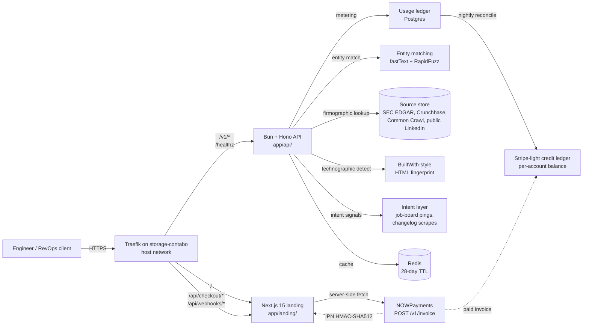

# 02 — Architecture

## High-level system diagram



(The Postgres and Redis layers are stubs in the Wave 2 build — the API returns a deterministic synthetic response so the contract is real even before the source layer is wired up.)

## Components

### Edge (Traefik)
- Single Traefik instance on `storage-contabo`, host-network mode. Two routers under one host, distinguished by path:
  - `Host(\`lead-enrichment.prin7r.com\`) && (PathPrefix(\`/v1/\`) || Path(\`/healthz\`))` → `triangulate-api:8080`
  - `Host(\`lead-enrichment.prin7r.com\`)` → `triangulate-landing:3000` (default).
- Letsencrypt resolver `letsencrypt`, HTTP-01 challenge. Certs mounted from existing Traefik volume.
- The Next.js NOWPayments invoice + IPN routes (`/api/checkout/*`, `/api/webhooks/*`) ride the default landing router because they are colocated with the landing app.

### Landing (Next.js 15)
- App Router, React 19, server components by default.
- `output: "standalone"` for slim Docker runtime.
- Tailwind 3.4 + ShadCN primitives.
- Server-side route `/api/checkout/nowpayments` creates the invoice via `POST https://api.nowpayments.io/v1/invoice` and returns `{ invoiceUrl, orderId }`.
- Server-side route `/api/webhooks/nowpayments` verifies the `x-nowpayments-sig` HMAC-SHA512 over `JSON.stringify(sortObject(payload))`, then would persist a paid-credit-pack event to the credit ledger (in this Wave 2 stub it logs and returns 200).

### API (Bun + Hono)
- `bun@^1.1` runtime, `hono@^4` router.
- `GET /healthz` → liveness. Returns `{ status: 'ok', service: 'triangulate-api', ts: <ms> }`.
- `POST /v1/enrich` → core endpoint. Validates body via `zod`. Returns the canonical enrichment response (see schema below).
- `GET /v1/coverage` → meta endpoint listing supported regions, freshness windows, and confidence-score banding.
- `Authorization: Bearer <key>` middleware: in dev, accepts any non-empty key; in production, would validate against Postgres.
- All responses include the `x-triangulate-correlation-id` header for traceability.

### Source layer (stubbed in Wave 2)
- **Firmographics** — SEC EDGAR (US public), Companies House (UK), and Crunchbase open snapshots. Cached at the firm level for 28 days.
- **Decision-maker mapping** — public LinkedIn + DuckDuckGo OSINT + Common Crawl. Cached per-domain for 14 days.
- **Technographics** — HTML response fingerprinting (header probes only — no DOM scraping). Cached per-domain for 7 days.
- **Intent** — job-board posting cadence, changelog activity, news mentions. Cached per-domain for 24 hours.
- **Contact triangulation** — pattern-matching first/last + domain against MX-validated SMTP echo and HaveIBeenPwned-style breach disclosures (public meta only — never the password content).

### Storage (stubbed in Wave 2)
- **Postgres 16** for the credit ledger and per-account configuration.
- **Redis 7** for cache layers (firmographic, decision-maker, technographic, intent).
- **Object storage (Contabo S3-compat)** for raw source artifacts so any returned field can be re-derived from a stored snapshot. This is what makes "source-linked" honest.

## Data flow — single enrichment request

1. Client `POST /v1/enrich` with `{ email | domain | name + company }`.
2. API validates with `zod`. Empty body → 400.
3. Auth middleware checks bearer; missing → 401.
4. Cache lookup on the canonical key (`sha256(domain + name)`). Hit → return cached response with `cached: true`.
5. Miss → call source-layer fan-out (firmographic, decision-maker, technographic, intent, contact-triangulation) in parallel. Each call has a 1.0s budget. A failed source returns `null` for its slice — never a 5xx for the whole request.
6. Confidence scoring per field: each value carries a 0.0–1.0 score and at least one source URL.
7. Cache write with 28-day TTL.
8. Decrement credit balance (1 credit per successful enrichment).
9. Return JSON.

Total budget: 1.5s P95.

## Response schema (the contract the landing documents)

```json
{
  "request": { "input": { "email": "jane.doe@stripe.com" }, "ts": 1715212800000, "correlationId": "01hyz..." },
  "person": {
    "fullName": { "value": "Jane Doe", "confidence": 0.97, "sources": ["https://stripe.com/about/jane-doe"] },
    "title":    { "value": "Engineering Manager, Payments", "confidence": 0.94, "sources": ["https://www.linkedin.com/..."] },
    "department": { "value": "Engineering", "confidence": 0.95 },
    "location": { "value": { "city": "San Francisco", "country": "US" }, "confidence": 0.86 }
  },
  "company": {
    "domain": "stripe.com",
    "name": { "value": "Stripe, Inc.", "confidence": 0.99, "sources": ["https://www.sec.gov/cgi-bin/browse-edgar?CIK=stripe"] },
    "industry": { "value": "Financial Infrastructure", "confidence": 0.96 },
    "employeeCount": { "value": 8500, "range": [7000, 10000], "confidence": 0.83 },
    "hqLocation": { "value": { "city": "South San Francisco", "country": "US" }, "confidence": 0.95 },
    "fundingStage": { "value": "Late stage / private", "lastRound": "Series I, 2026-03", "confidence": 0.91 }
  },
  "technographics": [
    { "category": "CDN", "vendor": "Cloudflare", "confidence": 0.98 },
    { "category": "Frontend framework", "vendor": "React", "confidence": 0.94 }
  ],
  "intent": {
    "hiring": { "openRoles": 142, "byDept": { "Engineering": 71, "Sales": 24, "Other": 47 }, "asOf": "2026-05-07" },
    "newsMentions7d": 8,
    "changelogActivity": "active"
  },
  "contactTriangulation": {
    "emailDeliverability": { "status": "valid", "method": "smtp_echo + mx_match", "confidence": 0.92 },
    "phonePatternMatch": { "status": "not_attempted" }
  },
  "meta": { "freshness": { "ageDays": 3, "refreshedAt": "2026-05-05T08:00:00Z" }, "creditsRemaining": 9_873 }
}
```

## Deploy topology

```
storage-contabo (161.97.99.120)
├── Traefik (host network, :443)
└── /opt/prin7r-deploys/lead-enrichment/
    └── docker compose
        ├── triangulate-landing  (next:standalone, expose 3000)
        └── triangulate-api      (bun runtime,    expose 8080)
```

Traefik labels on each container distinguish the two by path prefix (see `docker-compose.yml`). DNS is the existing wildcard `*.prin7r.com → 161.97.99.120` — no per-subdomain record needed.

## Failure modes & timeouts

| Layer | Timeout | On failure |
| --- | --- | --- |
| Source-layer fan-out | 1.0s/source | Field returns `null`; response still 200 |
| Total request budget | 1.5s P95 | 504 with `{ error: "timeout", correlationId }` |
| NOWPayments invoice | 5s | 502 with `{ error: "upstream_invoice_failed" }` |
| IPN webhook signature mismatch | n/a | 401 — never persists |
| Auth: invalid bearer | n/a | 401 with `{ error: "unauthorized" }` |
| Auth: expired/zero credits | n/a | 402 with `{ error: "no_credits" }` |
| Body validation (zod) | n/a | 400 with `{ error, issues: [...] }` |

## Observability

- Every request gets an `x-triangulate-correlation-id` (ULID).
- Health: `/healthz` returns `{ status, service, ts }`. Used by Traefik liveness probe.
- Future: Loki + Promtail tail of both containers; `/metrics` Prometheus endpoint on `:9090` exposed via Traefik IPAllowList only.

## Why this architecture (decision log)

- **Bun + Hono** instead of Node + Express because the cold-start path is half the size and the per-request memory footprint stays under 60MB on the storage-contabo runtime budget.
- **Two services behind one Traefik** instead of two subdomains because the audience is engineers reading API docs alongside pricing — a single hostname is a smaller cognitive load and CORS goes away.
- **No managed database in Wave 2** — the API ships with deterministic stubs; the cache and credit-ledger layers are designed-in but not yet provisioned because Wave 2 ships the contract and pricing surface, not the source-layer fleet.
- **NOWPayments hosted invoice** instead of direct-deposit because it absorbs the chain/currency UX (the user picks USDT-TRC20 / USDC-Polygon / etc. on the NOWPayments page) and we never touch their wallet.
